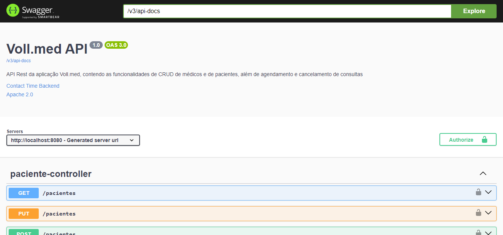
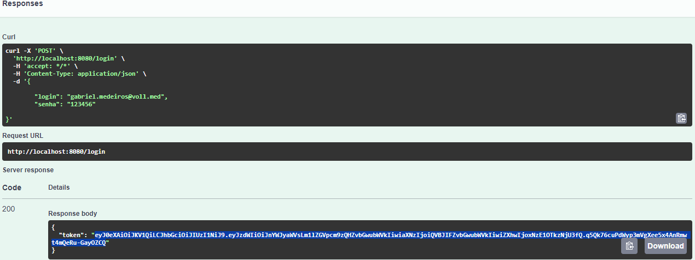
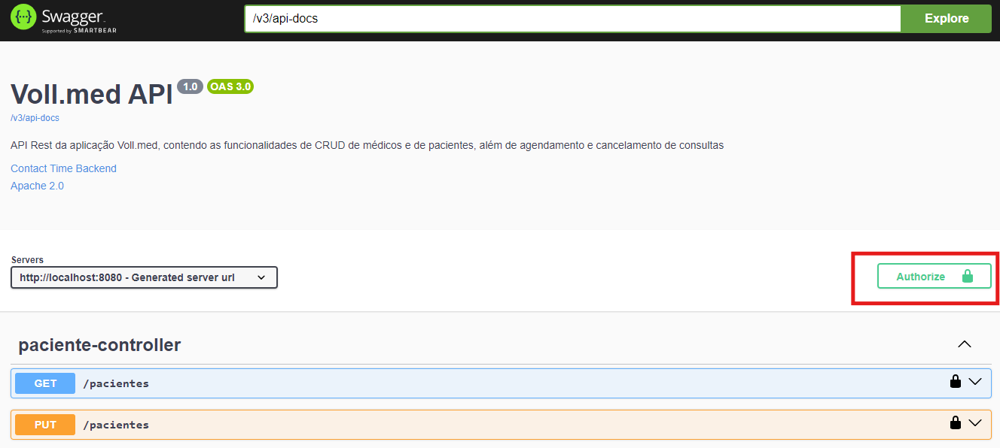
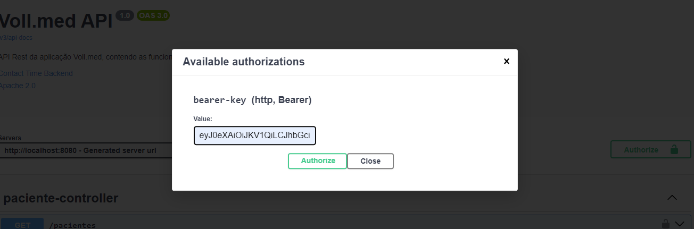

<h1 align="center">
  VollMed-API-Rest
</h1>


API para cadastrar medicos e pacientes, e agendar consultas utilizando metodos (CRUD).

Detalhamento dos requisitos e lógica de negocio em [Trello](https://trello.com/invite/b/oBUBd2Sx/ATTI0a961eda1bb14b2f46b09abfcc2dfbf222575840/api-voll-med)

## Tecnologias

- [Spring Boot](https://spring.io/projects/spring-boot)
- [Spring MVC](https://docs.spring.io/spring-framework/reference/web/webmvc.html)
- [Spring Data JPA](https://spring.io/projects/spring-data-jpa)
- [Spring Security](https://spring.io/projects/spring-security)
- [SpringDoc OpenAPI 3](https://springdoc.org/v2/#spring-webflux-support)
- [Postgres](https://www.postgresql.org/)
- [Docker Compose](https://docs.docker.com/compose/)

## Práticas adotadas

- SOLID, DRY, YAGNI, KISS
- API REST
- Consultas com Spring Data JPA
- Injeção de Dependências
- Autenticação com token JWT
- Tratamento de respostas de erro
- Testes unitários
- Geração automática do Swagger com a OpenAPI 3
- Execução do Postgres em conteiner docker

## Como Executar

- Clonar repositório git
```
$ git clone https://github.com/Gabrielmdrs/VollMed-API-Rest.git
```
- Configurar arquivo docker compose conforme docker.md
- Executar comando docker:
```
$ cd docker
$docker-compose up -d
```
- Configurar conexão bd em aplication.properties conforme configuração 
docker-compose ou banco a ser utilizado
- Rodar ApiApplication para criação de tabelas via migrations
- Inserir manualmente na tabela usuarios login e senha (PRECISA SER FORMATO Bcrypt)


## API Endpoints
A API poderá ser acessada em [localhost:8080](http://localhost:8080).

Documentação disponivel em [localhost:8080/swagger-ui.html](http://localhost:8080/swagger-ui.html)



Para realizar requisições em pacientes/consultas/medicos precisa obter token de autenticação em /login:



Clicar em Authorize e inserir token obtido:




